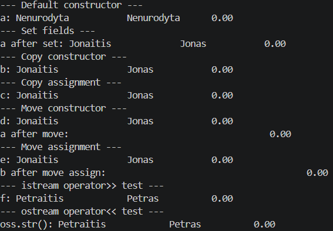

**Rule of Five — perdengti metodai**

| Metodas | Parašas | Paskirtis |
|---|---|---|
| Konstrukcija (numatytasis) | `Studentas()` | Sukuria objektą su `vard="Nenurodyta"`, `pav="Nenurodyta"`. |
| Konstruoti iš srauto | `Studentas(std::istream&)` | Skaito vieną įrašo eilutę per `readStudent` (naudojamas `operator>>`). |
| Kopijavimo konstruktorius | `Studentas(const Studentas&)` | Atlieka gilų kopijavimą (`std::string`, `std::vector`). |
| Kopijavimo priskyrimas | `Studentas& operator=(const Studentas&)` | Priskiria reikšmes (saugaus self-assignment). |
| Perkėlimo konstruktorius | `Studentas(Studentas&&) noexcept` | Efektyviai perkelia resursus (strings/vectors). |
| Perkėlimo priskyrimas | `Studentas& operator=(Studentas&&) noexcept` | Efektyviai perkelia resursus priskiriant. |
| Destruktorius | `~Studentas()` | Atlaisvina/užbaigia objektą; klasėje papildomai loguojama (debug). |
| Srautų operatoriai | `operator>>` / `operator<<` | Leidžia patogiai skaityti/rašyti vieną studento įrašą kaip tekstą. |

Iš failo duomenims skaityti naudojama funkcija *ivestIsFailo*, kurioje naudojamas perdengtas operatorius >>

**ss >> naujasStud**

Rankiniu būdu įvesti duomenims, automatiškai generuoti naudojama funkcija *ivestEkr*. 

Abiejose iš jų naujo studento pridėjimui naudojamas move konstruktorius: 

**studentai.push_back(std::move(naujasStud));** 

Studentų išvedimui į ekraną naudojama funkcija *isvestEkr*.

Studentų išsaugojimui faile naudojama funkcija *isvestIFaila*.

Abiejose naudojamas perdengtas operatorius <<

**cout << stud << '\n';**

**file << '\n' << stud;**

