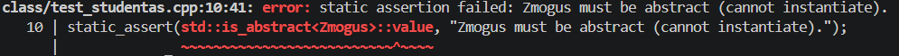
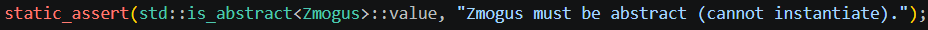

**Abstrakti klasė `Zmogus`**

Šioje versijoje pridėta abstrakti bazinė klasė `Zmogus`, skirta bendrai aprašyti žmogų (vardas, pavardė). `Studentas` yra iš jos išvestinė klasė. Svarbiausi punktai:

| Klasė | Savybės | Pastabos |
|---|---|---|
| `Zmogus` | `vard_`, `pav_`, get/set metodai | Abstrakti (pure-virtual destruktorius) — objekto sukurti negalima.
| `Studentas` | paveldėtos `vard_`/`pav_`, `tarp_`, `egz_`, `gal_` | Išlaikytas v1.2 funkcionalumas; įgyvendinta „penkių metodų“ taisyklė.

Demonstracija: testuose yra compile-time patikra, kad `Zmogus` yra abstrakti klasė, objektų kūrimas negalimas:

